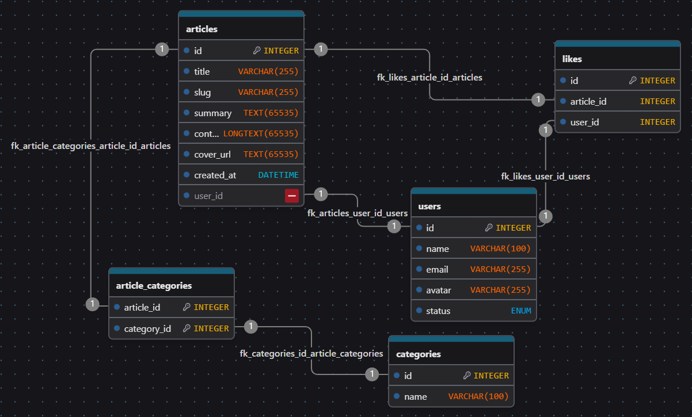

# 📰 Blog avec authentification et système de likes

Ce projet est une application de blog développée avec **Next.js 15**. Elle permet d'afficher des articles, de les liker, et d’administrer le contenu via une interface sécurisée.  
L’authentification est gérée avec **NextAuth**, et les likes sont stockés en base de données.

---

## 📚 Contexte

Ce projet a été réalisé dans le cadre de ma formation en développement web chez **Wild Code School**.  
Il m’a permis de consolider mes compétences sur :

- Next.js App Router
- API routes / REST backend avec MySQL
- Authentification sécurisée (NextAuth)
- Gestion de contexte React

---

## 🛠️ Technologies utilisées

- **Next.js 15 (App Router)**
- **TypeScript**
- **MySQL** (via `mysql2`)
- **NextAuth** (authentification avec sessions)
- **Context API** (gestion utilisateur et articles)
- **REST API maison** (routes API dans `/api`)
- **ESLint + Prettier**

---

## 🖼️ Fonctionnalités

- Affichage dynamique des articles (`/blog/[slug]`)
- Authentification via NextAuth
- Like d’un article si connecté
- Affichage conditionnel des interactions
- Administration privée possible (si rôle admin) pour ajouter, modifier, ou supprimer un article
- Système de contextes pour partager les données globales

---

## Database



---

## 💻 Installation en local

> Prérequis : Node.js 18+, MySQL installé, un `.env.local` configuré

### 1. Cloner le dépôt

```bash
git clone git@github.com:Jordan-182/DevBlog.git
cd DevBlog
npm install
```

# Connexion à la base de données MySQL et NextAuth (authentification)

- Remplir le .env en suivant l'exemple du .env.sample

# Créer la base de données et l'hydrater

```bash
npm run db:migrate
npm run db:seed
```

# Lancer le projet

```bash
npm run dev
```

- Se rendre sur : http://localhost:3000
